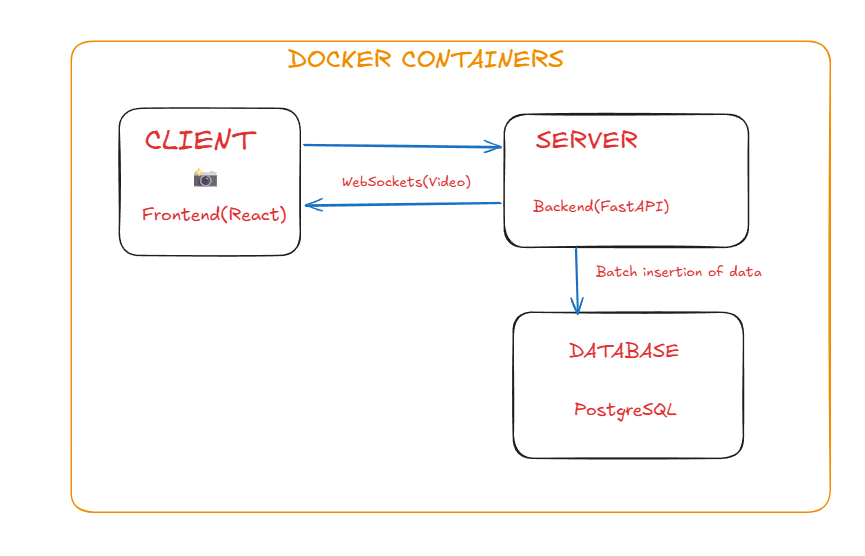

# Real-Time Face Detection System


## Overview
A high-performance, real time face detection web application built with React, FastAPI, MediaPipe, and PostgreSQL. This system captures a live video feed, processes facial recognition in the backend, and overlays bounding box on the client in real-time.

## Architecture Highlights
* **Two directional WebSockets:** Instead of traditional REST API polling, video streams are transmitted via a continuous WebSocket connection (`/ws/stream`) to guarantee low latency.
* **In-Memory Database Batching:** To protect the PostgreSQL instance from I/O bottlenecking during high-framerate streams, database writes are buffered in system memory and executed in batches. 
* **Matrix Math:** Bounding box coordinate calculations are handled using NumPy matrix operations.
* **Automated Testing:** CI/CD ready with a configured `pytest` suite simulating client-server interactions.

## Quick Start (Docker)
This application is fully containerized. You do not need to install Python, Node, or PostgreSQL on your local machine to run it.

1. Ensure [Docker Desktop](https://www.docker.com/products/docker-desktop/) is installed and the engine is running.
2. Clone this repository and navigate to the root directory.
3. Build and spin up the environment:
   ```bash
   docker compose up -d --build
4. Open your browser and navigate to the frontend client at: http://localhost:5173

### AI Assistance Disclosure
* **Infrastructure & Boilerplate:** Used to generate the initial SQLAlchemy ORM configurations in `models.py` and database session management in `database.py`.
* **Frontend Styling:** Assisted in the implementation of responsive UI components using Tailwind CSS classes.